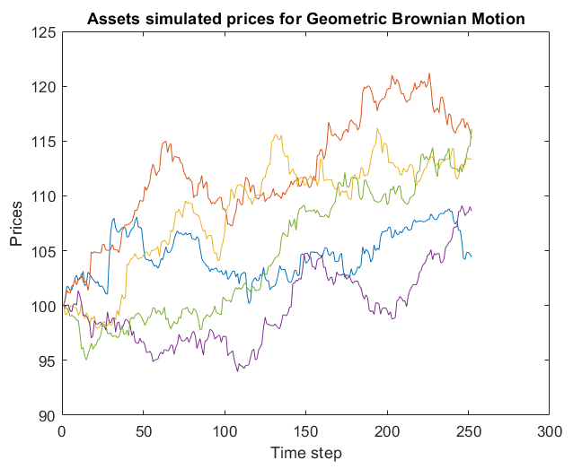
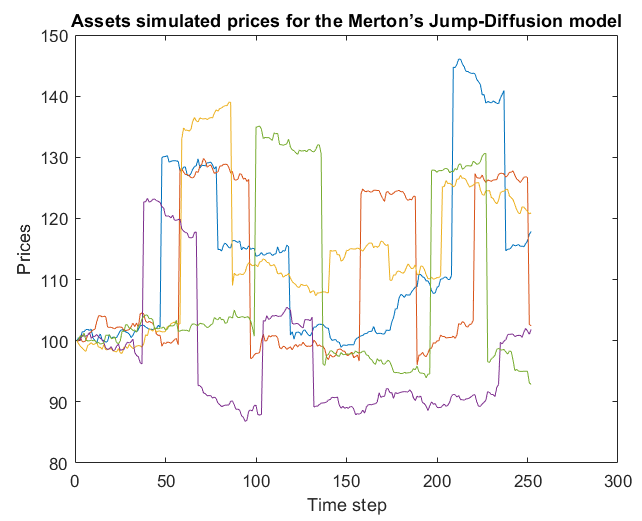
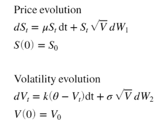
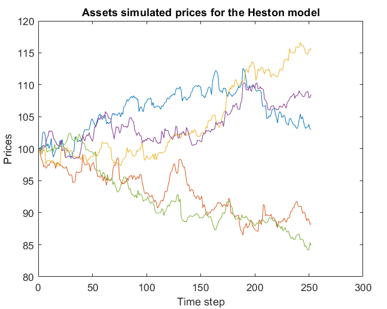
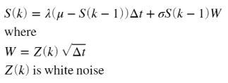
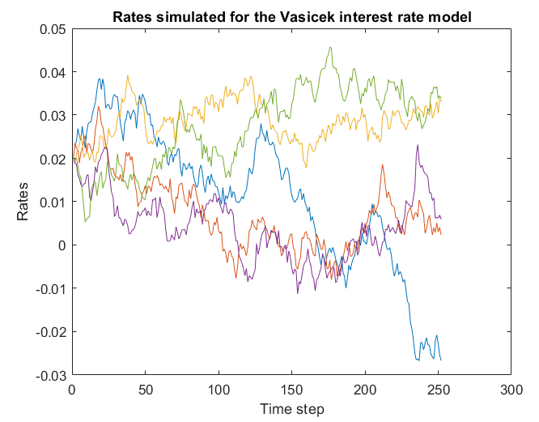
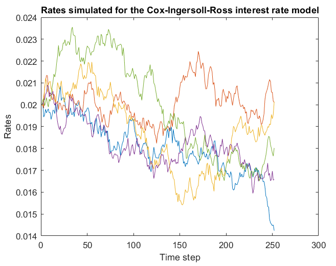

# Stochastic Valuation Processes

For a more pleasant version of the documentation, please visit the File Exchange site for Matlab

**Contents**

1. [Rationale](#rationale)
2. [Introduction to the Matlab class](#introduction-to-the-matlab-class)
3. [Stochastic Methods implemented](#stochastic-methods-implemented)
    - [Stock Prices](#stochastic-methods-implemented)
        - [Brownian Motion](#brownian-motion)
        - [Geometric Brownian Motion](#geometric-brownian-motion)
        - [Merton’s Jump-Diffusion Model](#mertons-jump-diffusion-model)
        - [Heston Model](#heston-model)
    - [Bond Rates](#bond-rates)
        - [Vasicek interest rate model](#vasicek-interest-rate-model)
        - [Cox-Ingersoll-Ross interest rate model](#cox-ingersoll-ross-interest-rate-model)
4. Utilities
    - Order Flow
    - Information Driven Bars
        - Tick Imbalance Bars
        - Volume and Dollar Imbalance Bars
5. Future Work

##Rationale
This toolbox packages a set of stochastic processes for prices and rates simulation, aiming to create a synthetic dataset for quantitative back-testing of trading strategies and asset allocations methods. 

Simulating synthetic stock prices and bond rates provides an alternative back-testing method that uses history to generate datasets with statistical characteristics estimated from the observed data. This method allows back-testing on a large sample of unseen scenarios, hence reducing the likelihood of overfitting to a particular historical data set.
Because each trading strategy needs an implementation tactic (a.k.a., trading rules) to enter, maintain, and exit the respective positions on each instrument, a simulation over thousands of different scenarios is mandatory. However, there is an implicit tradeoff. 

The historical data will show the 'real' state of the financial instruments based on the realized combinations of events that affect each market. Thereby, a traditional portfolio manager will design a set of rules that optimize or hedge the profits for those specific combinations of events. Therefore, an investment strategy that relies on parameters fitted solely by one combination of events is doomed to fail.

Such a framework for designing trading strategies is limited in the amount of knowledge that can incorporate. So, simulating thousands or even millions of possibles scenarios for the future will robust the way that an econometric method exploits an inefficiency in the market.

Based on the previous postulate, I have created a toolbox that packages different stochastic processes (a.k.a, valuation methods) for back-testing synthetic data. 

The processes that were for this version of the toolbox are: 

1. **Stock prices**
- Brownian Motion
- Geometric Brownian motion
- Merton model
- Heston model
2. **Bond Rates**
- Vasicek model
- Cox Ingersoll Ross model

Without further due, let's briefly dive into each process and how you can use the toolbox in your Matlab session.

##Introduction to the Matlab class
All the processes are methods that recreate the price path for an asset based on the user's configuration. As such, the user can initialize the class with the following command. Please be aware that the user should enter the parameters as name-value arguments for the definition of the class.
```
% Creating the object that has the initialized class 
% This is read as follows: Generate 5 securities with 252 datapoints
% each, were the time step between each observation is 1, and  the start
%  price for the securities is $100.
sim = randomProcesses("n", 5, "T", 252, "h", 1, "s0", 100);
```

In this case, each name-value argument is defined as follows:

- **T**: number of observations to generate for each time series.
- **h**: the size of the step. 
- **n**: number of paths to generate.
- **s0**: initial price to the state for each of path to generate, be aware that if you want to simulate rates, this number is considered as a percentage (e.g., 30 = 0.3 in the rates environment).
- **sigma**: trading intensity. This parameter is used for the volume generation process and is not related to the associated volatility of each instrument.

In the case the user wants a rapid check of the documentation for each process, he/she can input the following command in the Matlab console. 

```
doc("randomProcesses")
```
##Stochastic Methods implemented
###Stock Prices
####Brownian Motion
This method implements  a discrete time stochastic process for a Brownian motion that satisfies the following stochastic differential equation (SDE):


The Euler–Maruyama method is used for the numerical solution of the SDE and has the following recurrence:


The name-value arguments for the method are: 
    - **mu**(float): Historical means of returns
    - **sigma**(float): Historical volatility of returns
    - **sto_vol**(logical): Optional argument for the helper that states if the volatility should be constant of stochastic in the data generation process. Default is false for this process.

Usage:

```
% Generate the prices paths and save the variable
brownian_prices = sim.brownian_prices("mu", 0.04, "sigma", 0.15);
% plot the results
plot(brownian_prices) 
title('Assets simulated prices for Brownian Motion')
ylabel('Prices')
xlabel('Time step')
```


##Geometric Brownian Motion
The Geometric Brownian Motion (GBM) was popularized by Fisher Black and Myron Scholes in their paper The Pricing of Options and Corporate Liabilities. In that paper, they derive the Black Scholes equation. The GBM is essentially a Brownian Motion with constant drift and a stochastic volatility component. 

The stochastic differential equation (SDE) which describes the evolution of a Geometric Brownian Motion stochastic process is the following:


The Euler–Maruyama method is used for the numerical solution of the SDE and has the following recurrence:


The name-value arguments for the method are:

- **mu**(float): Historical means of returns
- **sigma**(float): Historical volatility of returns
- **sto_vol**(logical): Optional argument for the helper that states if the volatility should be constant of stochastic in the data generation process. Default is true for this process.

Usage:
```
% Generate the prices paths and save the variable
gbm_prices = sim.gbm_prices("mu", 0.04, "sigma", 0.15);
% plot the results
plot(gbm_prices) 
title('Assets simulated prices for Geometric Brownian Motion')
ylabel('Prices')
xlabel('Time step')
```


##Merton’s Jump-Diffusion Model
In essence, this is a process that allows for a positive probability of a stock price change of extraordinary magnitude, no matter how small the time interval between successive observations. More formally, this is a Poisson-driven process, in which the "event" is the arrival of an essential piece of information that creates an abnormal increase/decrease in price. 
The stochastic differential equation (SDE) which describes the evolution of a Merton stochastic process is the following:


The Euler–Maruyama method is used for the numerical solution of the SDE and has the following recurrence:


The name-value arguments for the method are: 

- **lambda**(double): Moment of arrival of an important piece of information.
- **mu**(double): Historical mean of returns.
- **sigma**(double): Historical volatility of returns.
- **sto_vol**(logical): Optional argument for the helper that states if the volatility should be constant of stochastic in the data generation process. Default is true for this process.

Usage:
```
% Generate the prices paths and save the variable
% The arrival of critical information will arrive every 30
% iterations until the end of the data points.
merton_prices = sim.merton_prices("mu", 0.04, "sigma", 0.15, 'lambda', 30);
% plot the results
plot(merton_prices) 
title('Assets simulated prices for the Merton’s Jump-Diffusion model')
ylabel('Prices')
xlabel('Time step')
```



##Heston Model
The original Geometric Brownian Motion stochastic process assumes that volatility over time is constant. In the early 1990s, Steven Heston relaxed this assumption and extended the Geometric Brownian Motion model to include stochastic volatility. The resulting model is called the Heston model. 

In the Heston model, the volatility over time evolves according to the Cox Ingersoll Ross stochastic process. As such, the model makes use of two Wiener processes, one for the Cox Ingersoll Ross process and another for the Geometric Brownian Motion process. These two Wiener processes are correlated using Singular Value Decomposition.

The stochastic differential equations (SDE) for the Cox-Ingersoll-Ross and the Heston model are:



The Euler–Maruyama method is used for the numerical solution of the SDE and has the following recurrence:


The name-value arguments for the method are:

- **rf**(double): Risk-free interest rate, theoretical rate on an asset carrying no risk. Default value is 0.02
- **theta**(double): Long term price variance. Default value is 1
- **k**(double): Rate reversion to the long term variance. Default value is 0.5
- **sigma**(double): Historical volatility of returns. Default value is 1
- **sto_vol**(logical): Optional argument for the helper that states if the volatility should be constant of stochastic in the data generation process. Default is false for this process.

Usage:
```
% Generate the prices paths and save the variable
heston_prices = sim.heston_prices('rf', 0.01, 'theta', 0.5, ...
    'k', 0.8, 'sigma', 0.2);
% plot the results
plot(heston_prices) 
title('Assets simulated prices for the Heston model')
ylabel('Prices')
xlabel('Time step')
```


#Bond Rates
##Vasicek interest rate model
The Vasicek interest rate model (or merely the Vasicek model) is a mathematical method of modeling interest rate movements. The model describes the evolution of an interest rate as a factor composed of market risk, time, and equilibrium value, where the rate tends to revert towards the mean of those factors over time. Essentially, it predicts where interest rates will end up at the end of a given period, given current market volatility, the long-run mean interest rate value, and a given market risk factor.

The stochastic differential equation (SDE) for the Vasicek Interest Rate Model process is given by:


The Euler–Maruyama method is used for the numerical solution of the SDE and has the following recurrence:



The name-value arguments for the method are:

- **mu**(double): Long term mean level. All future trajectories of s will evolve around a mean level μ in the long run. Default value is 0
- **sigma**(double): Instantaneous volatility, measures instant by instant the amplitude of randomness entering the system. Higher σ implies more randomness. Default value is 1
- **lambda**(double): Speed of reversion. λ characterizes the velocity at which such trajectories will regroup around μ in time. Default value is 0.5
- **sto_vol**(logical): Optional argument for the helper that states if the volatility should be constant of stochastic in the data generation process. Default is false for this process.

Usage:
```
% Create the object for the rate series
% The following object can be read as follows: Create 5 instruments with
% 252 observations each, were the time step between the observations is 1
% and the initial rate is 0.02 (i.e., 2%)
sim2 = randomProcesses('n', 5, 'T', 252, 'h', 1, 's0', 2);
% Generate the prices paths and save the variable
vas_rates = sim2.vas_rates("mu", 0.018, "sigma", 0.03, 'lambda', 0.9);
% plot the results
plot(vas_rates) 
title('Rates simulated for the Vasicek interest rate model')
ylabel('Rates')
xlabel('Time step')
```


##Cox-Ingersoll-Ross interest rate model
The Cox-Ingersoll-Ross model (CIR) is a mathematical formula used to model interest rate movements and is driven by a sole source of market risk. It is used as a method to forecast interest rates.  The stochastic process is often used in the valuation of interest rate derivatives and has been used in the Heston model to describe the evolution of volatility over time. One interesting characteristic of the CIR stochastic process is that it is mean reverting.

***The main distinction with the Vasicek model is that the Cox-Ingersoll Ross model does not allow for negative interest rates.***

The stochastic differential equation (SDE) for the Cox-Ingersoll-Ross Interest Rate Model process is given by:


The Euler–Maruyama method is used for the numerical solution of the SDE and has the following recurrence:


The name-value arguments for the method are:

- **mu**(double): Long term mean level. All future trajectories of s will evolve around a mean level μ in the long run. Default value is 0
- **sigma**(double): Instantaneous volatility, measures instant by instant the amplitude of randomness entering the system. Higher σ implies more randomness. Default value is 1
- **lambda**(double): Speed of reversion. λ characterizes the velocity at which such trajectories will regroup around μ in time. Default value is 0.5
- **sto_vol**(logical): Optional argument for the helper that states if the volatility should be constant of stochastic in the data generation process. Default is false for this process.

Usage:
```
% Generate the prices paths and save the variable
cir_rates = sim2.cir_rates("mu", 0.018, "sigma", 0.03, 'lambda', 0.9);
% plot the results
plot(cir_rates) 
title('Rates simulated for the Cox-Ingersoll-Ross interest rate model')
ylabel('Rates')
xlabel('Time step')
```
