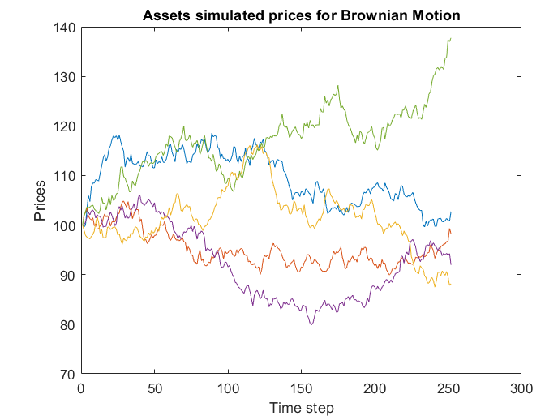

# Stochastic Valuation Processes

**Contents**

1. [Rationale](#rationale)
2. [Introduction to the Matlab class](#introduction-to-the-matlab-class)
3. [Stochastic Methods implemented](#stochastic-methods-implemented)
    - [Stock Prices](#stochastic-methods-implemented)
        - [Brownian Motion](#brownian-motion)
        - [Geometric Brownian Motion](#geometric-brownian-motion)
        - Merton’s Jump-Diffusion Model
        - Heston Model
    - Bond Rates
        - Vasicek interest rate model
        - Cox-Ingersoll-Ross interest rate model
4. Utilities
    - Order Flow
    - Information Driven Bars
        - Tick Imbalance Bars
        - Volume and Dollar Imbalance Bars
5. Future Work

##Rationale
This toolbox packages a set of stochastic processes for prices and rates simulation, aiming to create a synthetic dataset for quantitative back-testing of trading strategies and asset allocations methods. 

Simulating synthetic stock prices and bond rates provides an alternative back-testing method that uses history to generate datasets with statistical characteristics estimated from the observed data. This method allows back-testing on a large sample of unseen scenarios, hence reducing the likelihood of overfitting to a particular historical data set.
Because each trading strategy needs an implementation tactic (a.k.a., trading rules) to enter, maintain, and exit the respective positions on each instrument, a simulation over thousands of different scenarios is mandatory. However, there is an implicit tradeoff. 

The historical data will show the 'real' state of the financial instruments based on the realized combinations of events that affect each market. Thereby, a traditional portfolio manager will design a set of rules that optimize or hedge the profits for those specific combinations of events. Therefore, an investment strategy that relies on parameters fitted solely by one combination of events is doomed to fail.

Such a framework for designing trading strategies is limited in the amount of knowledge that can incorporate. So, simulating thousands or even millions of possibles scenarios for the future will robust the way that an econometric method exploits an inefficiency in the market.

Based on the previous postulate, I have created a toolbox that packages different stochastic processes (a.k.a, valuation methods) for back-testing synthetic data. 

The processes that were for this version of the toolbox are: 

1. **Stock prices**
- Brownian Motion
- Geometric Brownian motion
- Merton model
- Heston model
2. **Bond Rates**
- Vasicek model
- Cox Ingersoll Ross model

Without further due, let's briefly dive into each process and how you can use the toolbox in your Matlab session.

##Introduction to the Matlab class
All the processes are methods that recreate the price path for an asset based on the user's configuration. As such, the user can initialize the class with the following command. Please be aware that the user should enter the parameters as name-value arguments for the definition of the class.
```
% Creating the object that has the initialized class 
% This is read as follows: Generate 5 securities with 252 datapoints
% each, were the time step between each observation is 1, and  the start
%  price for the securities is $100.
sim = randomProcesses("n", 5, "T", 252, "h", 1, "s0", 100);
```

In this case, each name-value argument is defined as follows:

- **T**: number of observations to generate for each time series.
- **h**: the size of the step. 
- **n**: number of paths to generate.
- **s0**: initial price to the state for each of path to generate, be aware that if you want to simulate rates, this number is considered as a percentage (e.g., 30 = 0.3 in the rates environment).
- **sigma**: trading intensity. This parameter is used for the volume generation process and is not related to the associated volatility of each instrument.

In the case the user wants a rapid check of the documentation for each process, he/she can input the following command in the Matlab console. 

```
doc("randomProcesses")
```
##Stochastic Methods implemented
###Stock Prices
####Brownian Motion
This method implements  a discrete time stochastic process for a Brownian motion that satisfies the following stochastic differential equation (SDE):


The Euler–Maruyama method is used for the numerical solution of the SDE and has the following recurrence:


The name-value arguments for the method are: 
    - **mu**(float): Historical means of returns
    - **sigma**(float): Historical volatility of returns
    - **sto_vol**(logical): Optional argument for the helper that states if the volatility should be constant of stochastic in the data generation process. Default is false for this process.

Usage:

```
% Generate the prices paths and save the variable
brownian_prices = sim.brownian_prices("mu", 0.04, "sigma", 0.15);
% plot the results
plot(brownian_prices) 
title('Assets simulated prices for Brownian Motion')
ylabel('Prices')
xlabel('Time step')
```


##Geometric Brownian Motion
The Geometric Brownian Motion (GBM) was popularized by Fisher Black and Myron Scholes in their paper The Pricing of Options and Corporate Liabilities. In that paper, they derive the Black Scholes equation. The GBM is essentially a Brownian Motion with constant drift and a stochastic volatility component. 

The stochastic differential equation (SDE) which describes the evolution of a Geometric Brownian Motion stochastic process is the following:


The Euler–Maruyama method is used for the numerical solution of the SDE and has the following recurrence:


The name-value arguments for the method are:

- **mu**(float): Historical means of returns
- **sigma**(float): Historical volatility of returns
- **sto_vol**(logical): Optional argument for the helper that states if the volatility should be constant of stochastic in the data generation process. Default is true for this process.

Usage:
```
% Generate the prices paths and save the variable
gbm_prices = sim.gbm_prices("mu", 0.04, "sigma", 0.15);
% plot the results
plot(gbm_prices) 
title('Assets simulated prices for Geometric Brownian Motion')
ylabel('Prices')
xlabel('Time step')
```
